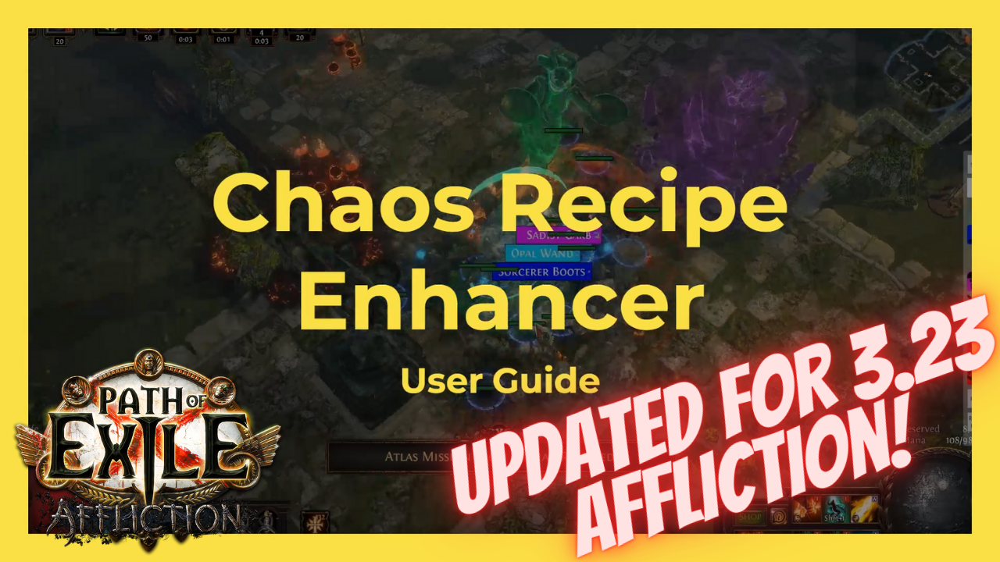
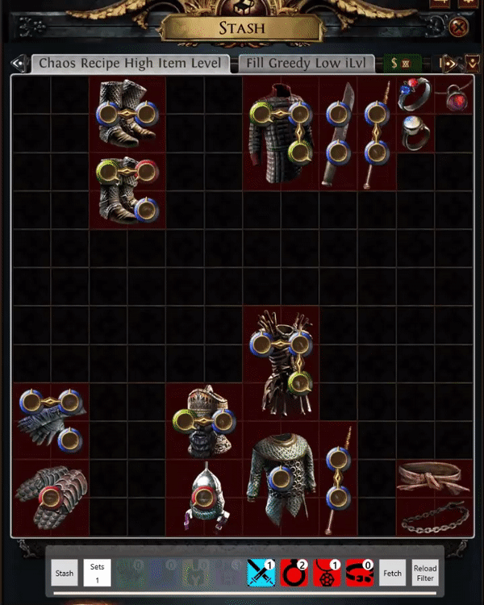
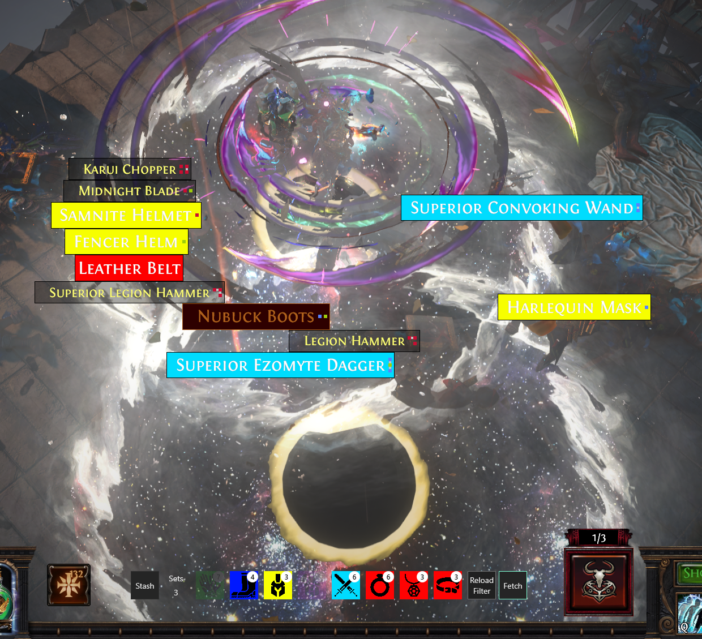
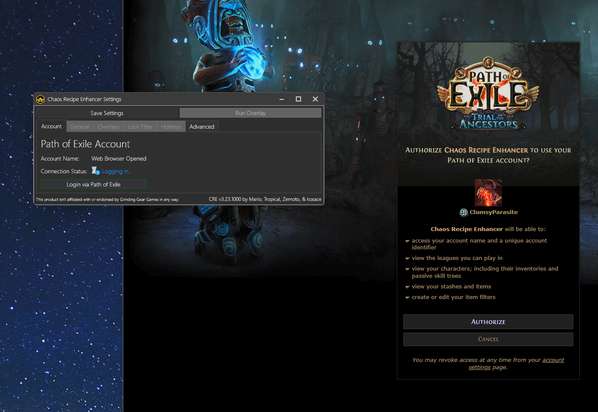
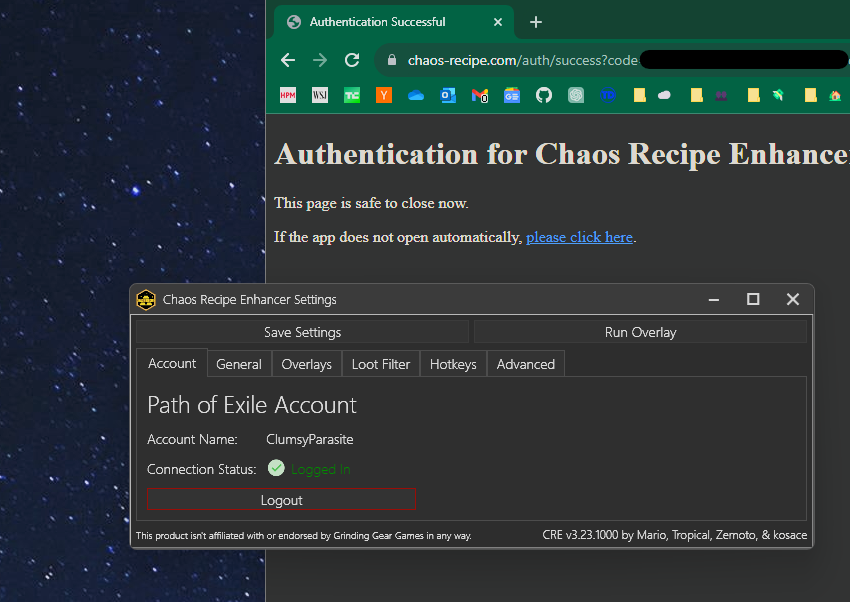

# Chaos Recipe Enhancer

``` This app isn't affiliated with or officially endorsed by Grinding Gear Games. ```

This app fetches your stash data from the PoE servers and shows which items you need to pick up to complete the [chaos orb recipe](https://www.poewiki.net/wiki/Chaos_Orb#Vendor_recipes). When you're ready to vendor a set, we'll highlight the item pick order, which is great when you're pulling from messy tabs. Optionally, it can also manipulate your offline loot filter, so you can fully streamline your farm.

[![downloads][downloads-badge]][releases-link]
[![release][releases-badge]][releases-link]
[![issues][issues-badge]][issues-link]
[![Discord][discord-badge]][discord-link]
[![Support][support-badge]][support-link]

## User Guide (Video)

<a href="https://youtu.be/ChC3GNYJpl8">
    
</a>

## Installation

0. Download and install the [.NET Runtime for Windows][dotnet-runtime-download-link]
1. Download and install the [latest the ChaosRecipeEnhancerSetup.msi][releases-link]

## Additional Features

- Query from your personal stash
- Query multiple stash tabs at once
- Customizable overlay position & sizes for different screen resolutions
- *Offline* loot filter manipulation (online filter syncing not supported)
- Automatically fetch remaining items when you join a new instance
- OAuth integration for a secure and simple connection to PoE data services

## Screenshots

### Stash Tab Overlay



### Set Tracker Overlay & Loot Filter Manipulation



### Secure 2-Click Integration with PoE Data Services via OAuth




## Copyright

```
Copyright (C) 2023 Chaos Recipe Enhancer Team

This program is free software: you can redistribute it and/or modify
it under the terms of the GNU General Public License as published by
the Free Software Foundation, either version 3 of the License, or
(at your option) any later version.

This program is distributed in the hope that it will be useful,
but WITHOUT ANY WARRANTY; without even the implied warranty of
MERCHANTABILITY or FITNESS FOR A PARTICULAR PURPOSE.  See the
GNU General Public License for more details.

You should have received a copy of the GNU General Public License
along with this program.  If not, see <http://www.gnu.org/licenses/>.
```

[downloads-badge]: https://img.shields.io/github/downloads/ChaosRecipeEnhancer/EnhancePoEApp/total?style=for-the-badge&logo=github
[discord-badge]: https://img.shields.io/discord/786617230879883307?color=5865f2&label=Discord&style=for-the-badge&logo=discord&link
[discord-link]: https://discord.gg/ryss9jnRkZ
[releases-badge]: https://img.shields.io/github/v/release/ChaosRecipeEnhancer/EnhancePoEApp?style=for-the-badge&logo=github
[releases-link]: https://github.com/ChaosRecipeEnhancer/EnhancePoEApp/releases
[issues-badge]: https://img.shields.io/github/issues-raw/ChaosRecipeEnhancer/EnhancePoEApp?style=for-the-badge
[issues-link]: https://github.com/ChaosRecipeEnhancer/EnhancePoEApp/issues
[support-badge]: https://img.shields.io/badge/Paypal-Support-<COLOR>?style=for-the-badge&logo=paypal&color=ffae29
[support-link]: https://www.paypal.com/donate/?hosted_button_id=4NDCV5J5NTEWS
[dotnet-runtime-download-link]: https://dotnet.microsoft.com/en-us/download/dotnet/thank-you/runtime-desktop-7.0.14-windows-x64-installer
