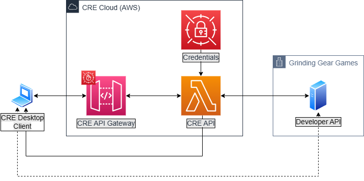
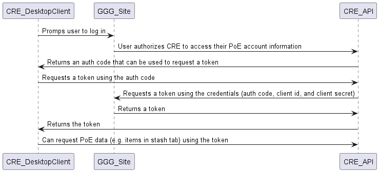

# CRE Backend (WIP)

Disclaimer: This new backend is very much a work in progress. Once we integrate OAuth into our main app, we'll need to rewrite our data fetching to support the official Path of Exile Developer API.

## Architecture Diagram

## Auth Flow Sequence

## Welcome to your CDK C# project

You should explore the contents of this project. It demonstrates a CDK app with an instance of a stack (`InfraStack`)
which contains an Amazon SQS queue that is subscribed to an Amazon SNS topic.

The `cdk.json` file tells the CDK Toolkit how to execute your app.

It uses the [.NET CLI](https://docs.microsoft.com/dotnet/articles/core/) to compile and execute your project.

## Useful commands

* `dotnet build src` compile this app
* `cdk ls`           list all stacks in the app
* `cdk synth`       emits the synthesized CloudFormation template
* `cdk deploy`      deploy this stack to your default AWS account/region
* `cdk diff`        compare deployed stack with current state
* `cdk docs`        open CDK documentation

Enjoy!
